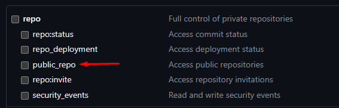

# Vue for Aspiring Front-End Engineers

Bem-vindo ao repositório open-source Vue for Aspiring Front-End Engineers! Este projeto é destinado para que outras pessoas possam editar e treinar programação utilizando Nuxt.js e Vue.  
Confira a [documentação do Nuxt](https://nuxt.com/docs/getting-started/introduction) e a [documentação do Nuxt UI](https://ui.nuxt.com) para aprender mais.

## Objetivo do projeto
O objetivo deste projeto é construir uma plataforma básica para visualização de vagas e criação de issues (vagas) diretamente via aplicação. Nosso objetivo é estabelecer um workflow definido e uma interface limpa para a criação de vagas no repositório, facilitando o processo de gerenciamento e colaboração.  
Após a finalização e amadurecimento do projeto, será apresentado para o mantenedor do repositório de vagas, para ser usado em conjunto.

## Setup

Indico usar o NPM para evitar bugs! O Yarn está muito instável e gerando muitos problemas com o Nuxt.   
Certifique-se de instalar as dependências:  

```bash
# npm
npm install

# pnpm
pnpm install

# yarn
yarn install

# bun
bun install
```

## Development Server

Inicie o servidor de desenvolvimento em `http://localhost:3000`:

```bash
# npm
npm run dev

# pnpm
pnpm run dev

# yarn
yarn dev

# bun
bun run dev
```

## Production

Compile a aplicação para produção:

```bash
# npm
npm run build

# pnpm
pnpm run build

# yarn
yarn build

# bun
bun run build
```

Faça uma pré-visualização local da build de produção:
```bash
# npm
npm run preview

# pnpm
pnpm run preview

# yarn
yarn preview

# bun
bun run preview
```

Consulte a [documentação de deployment](https://nuxt.com/docs/getting-started/deployment) para mais informações.

## Criação de Token no GitHub  
Para poder criar issues no repositório, é necessário criar um token de acesso pessoal no GitHub com o seguinte escopo:   
_public_repo_: É necessário apenas esse escopo para criação de issue usando a API do Github.


## Configuração do .env para uso
- Criar uma cópia do arquivo _.env-example_ para _.env_ e preencher o token com o gerado acima, será ele que fará a autenticação com os servidores do Github.
- (Necessário extensões para VsCode e WebStorm) Caso queira usar a query para descobrir as informações dos repositórios, pode criar um novo valor no _.env_ e inserir no arquivo _.graphql.config.yml_, na parte onde diz _${NUXT_SECRET_API_GRAPH_TOKEN}_ por sua nova chave do _.env_.
- Existem algumas querys de exemplo no arquivo _schema.gql_ que você pode começar a utilizar e brincar. 

## To-Do's 
Aqui estão algumas tarefas a serem realizadas nesse primeiro momento no projeto:

[] Adicionar documentação adicional: Aceito ajuda para formatar o readme melhor para ajudar quem está iniciando no Github.  
[] Melhorar visual dos cards de exibição das issues do repositório.   
[] Melhorar a contagem de Issues que está "solta".  
[] Fixar o Footer ao final da página.  
[] Melhorar o visual dos Badges que serão os labels da vaga.  
[] Implementar o Refetch no Header, ou em um lugar melhor, para refazer a chamada ao endpoint.  
[] Criar um modal com um formulário para preenchimento de dados.  
[] Verificar workflow do Ci/CD, não está funcionando como o esperado, está gerando aplicação do Readme: https://lucaspmarra.github.io/vue-for-aspiring-front-end-engineers/
